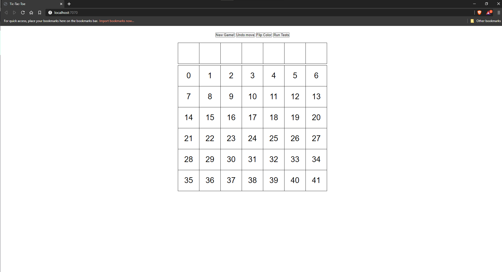

**Table of Contents** 

- [Vier Gewinnt (PiS, SoSe 2020)](#vier-gewinnt-pis-sose-2020)
  - [Einleitung](#einleitung)
    - [Spielregeln](#spielregeln)
    - [Bedienungsanleitung](#bedienungsanleitung)
    - [Dateiübersicht](#datei%C3%BCbersicht)
    - [Sonstige Quellen](#sonstige-quellen)


# Vier Gewinnt (PiS, SoSe 2020) 

Autor: Konstantin,Kühn, 5090662

Ich habe die Zulassung für PiS im SoSe 201> bei Herrn Herzberg erhalten.

<Inhaltsverzeichnis>

## Einleitung

### Spielregeln

Das Ziel des Spieles ist es, vor dem Gegner 4 eigene Steine in Horizontaler, Vertikaler oder Diagonalen Reihe zu platzieren und den Gegner von gleichigem abzuhalten.

### Bedienungsanleitung



Die Taste New Game löscht das aktuelle Spiel und ermöglicht es von vorne anzufangen, Undo Move macht den letzten zug rückgänig, Flip Color sorgt für das ändern der Farbe und Run Tests lässt die Tests ausführen.

Um einen Zug auszuführen muss in eins der Felder, der ersten Reihe gedrückt werden. Anschließend wird ein Zug von der AI ausgeführt, bevor man als Spieler wieder die Möglichkeit hat erneut einnen zug zu ziehen.

### Dateiübersicht

    \build.gradle
    \README.md
    \bin\main\public\index.html
    \bin\main\TicTacToe\App.kt
    \bin\main\TicTacToe\T3.kt
    \src\main\kotlin\FourWins\App.kt
    \src\main\kotlin\FourWins\FourWins.kt
     \src\main\kotlin\FourWins\GameEngine.kt
    \src\main\resources\public\index.html
     \src\main\resources\public\com.js

-------------------------------------------------------------------------------
Language                     files          blank        comment           code
-------------------------------------------------------------------------------
Kotlin                           4            117             42            485
XML                              6              0              0            299
Bourne Shell                     1             23             36            126
HTML                             1             23              0             81
DOS Batch                        1             26              2             76
JavaScript                       1             11              0             39
Gradle                           2              9             22             22
-------------------------------------------------------------------------------
SUM:                            16            209            102           1128
-------------------------------------------------------------------------------

    
    ## Spiel-Engine (ENG)

Feature    | AB  | H | K  | eD   | IM+I | Summe
-----------|-----|-----|-----|-----|------|----
Umsetzung  | 120 | 70 | 40 |   130 | 66.6 |
Gewichtung | 0.4 | 0.3 | 0.3 | 0.3 |  0.3 | 
Ergebnis   |  48 |  21 |  12 |   39 |   20 | **140%**

    
    
### Erläuterung
    
Innerhalb des GameEngine.kt Scipt befindet sich das Interface welches in der App.kt für 4Connect benutzt worden ist. 
    
Der [AlphaBeta](https://github.com/PascalPons/connect4/blob/part4/solver.cpp#L42) Algorithmus ist unter dem Namen
    ```kotlin
    override fun CalculateBestMove(depth: Int, alpha: Int, beta: Int, preventWin: Boolean): IntArray 
    ``` 
  in der FourWins.kt Datei in zeile 93 zu finden. Hier wird in einem IntArray der Score array[0] und der zugehörige Zug array[1] abgespeichert.
 Bevor ein Zug mit der AI ausgeführt werden kann, muss die Methode 
    ```kotlin
fun SetStartTime(time: Long, threshold: Int) 
``` 
    aufgerufen werden, um die StartZeit  und die Maximaldauer  zu übergeben. Erst danach kann CalculateBestMove aufgerufen werden.
 Sobald die maximale Tiefe erreicht worden ist oder die maximal berechnungsdauer, wird der beste Zug zurückgegeben.
    
    Der erste Wert liefert die Punktzahl zurück und der zweite das Spielfeld, um diesen Zug auch final auszuführen, muss man die Methode ```kotlin
     override fun Move(pos: Int,debug:Boolean): FourWins``` ausführen, um hier die richtige Position zu bekommen, müssen wir das erhaltene Feld von der AlphaBeta funktion mit %7 gegenrechnen, um die relevante Spalte zu erhalten.
    
    In Zeile 248 überprüfen wir ob das aktuelle Spielfeld gesehen vom letzten gespielten Stein eine GewinnBedingung erfüllt.
    
    Um eine Flut an abfragen zu vermeiden, habe ich mich für eine generische Umsetzung Entschieden, die ich als besonderes merkmal hervorheben möchte.
    In Zeile 249 legen wir ein IntArray an mit der Aufschlüsselung für eine Horizontale, Vertikale und zwei Diagonale überprüfung.
    Hierfür haben wir die Spalten und Zeilenanzahl definiert. 
    In Zeile 250-251 itterieren wir über alle Richtungen von der letzten Spielposition aus und bekommen ausgegben ob sich in diesem Bereich eine Gewinnstellung verbirgt.
    In Zeile 251 wird die Methode ```kotlin fun GenericStreakCheck(index: Int, steps: Int, streak: Int): Int ``` genutzt, welche mit einer for schleife beim frühsten möglichen Punkt für eine Gewinnstellung (Zeile: 232) bis zum letzten Punkt . Es wird überprüft ob der ausgewählte Index innerhalb der Grenzen liegt ( Zeile 234) und anschließend wird überprüft ob sich in diesem Feld der zugehörige Stein für das angefragte Feld liegt. Wenn dies der Fall ist, wird ein counter hochgezählt, welcher als ausgangspunkt die höhe des Streaks nutzt und sich zurücksetzt sobald etwas anderes als eine Gewinnposition gefunden wurde.
    
    Diese Methode bietet die Möglichkeit später mit nur geringen Änderungen die größe des Spielfeldes sowohl die benötigten Steine für einen Gewinn einfach zu ändern, ohne große Änderungen an der Methode. 
    
   In Zeile 12-15 wird eine [statische Variable](https://medium.com/@ansujain/kotlin-how-to-create-static-members-for-class-543d0f126f7c) angelegt, die für das Zwischenspeichern von schon bereits berechneten Spielzügen benutzt wird.
```kotlin
  companion object {
        var entries: HashMap<Int, IntArray> = HashMap<Int, IntArray>()

    }
```
    
    Für die eigene Datenbank dienen die folgenden Methoden: ```kotlin
    //will save the current board
    fun SaveDB()
    //will load the current board
    fun LoadDB()
```

Innerhalb der SaveDB Methode wird die aktuelle Hashmap in einen String konvertiert, der wiederum in ein ByteArray konvertiert wird, um anschließend in einer [Datei geschrieben](https://www.baeldung.com/kotlin-write-file) zu werden.
    
    Innerhalb der LoadDB wird die [Datei eingelesen](https://www.baeldung.com/kotlin-read-file) und dort im reverse Schritt wieder zu einer HashMap konvertiert. 
    
    Hierbei ist zu beachten das die Datenbank nach jedem AI Zug abgespeichert wird und bei jedem neuen Spiel geladen. Dies stellt sicher das keine berechneten Daten verloren gehen.
    
    
Als Kommunikation zwischen Seite und Backend wird ein Session System genutzt auf Basis von dem [Chat Tutorial]().
    ```js 
         ws.onmessage = messageEvent => {
     var id = messageEvent.data.substring(0,1)
     var mes = messageEvent.data.substring(1)
            if(id ==0)
            {
          renderBoard()
            } else if(id ==1)
            {
            document.getElementById('timeFeedback').innerHTML = mes;
            }else if (id=2){
            document.getElementById('interaction').innerHTML = mes;

            }

        }
```
    Hier wird eine erhalten Nachricht empfangen und verarbeitet. 
Ich habe der Nachricht die gesendet wird ein Int als ID hinzugefügt, um etnscheiden zu können was ich mit dieser Nachricht ansprechen möchte.
    
    ```kotlin
        app.apply {
            ws("/") { ws ->
                ws.onConnect { ctx ->
                    session = ctx
                    ctx.send("0 " + game.toString())
                }
                ws.onClose { ctx ->
                    //   game = FourWins()
                }
            }
``` 
    Um Nachrichten zu verschicken cache ich jegliche Verbindung und sende auch zugleiche den aktuellen Stand des Brettes.
    
    ```kotlin
                        session.send("ID"+ " " + message)

```
    mit der Referenz zu der aktuellsten Session ist es möglich, ann diese per send eine Nachricht zu übermitteln. Als erstest wird dort eine ID eingeügt und mit einem Leerzeichen von der Hauptnachricht getrennt.

    
### Sonstige Quellen
    Als basis für die Struktur der Homepage, das interagieren mit der Seite habe ich das [Tic Tac Toe Beispiel von Herrn Herzberg](https://git.thm.de/dhzb87/JbX/-/tree/master/TicTacToe/src/main/kotlin/TicTacToe) genommen.
    
    Beim Aufrufen der Seite wird eine Session gestartet die zur Kommunikation genutzt wird, hierfür habe ich mich an dem javalin tutorial für chat websockets  [tutorial für chat websockets ]( https://javalin.io/tutorials/websocket-example) orientiert.
   
    
    Für ein generelles verständlich wie Javalin funktionier habe ich die [Tutorial Seiten] (https://javalin.io/tutorials/) genutzt. 
    
    
    ## Tests (TST)

Szenario |  1  |  2  |  3  |  4  |  5  | Summe
---------|-----|-----|-----|-----|-----|-------
ok       |  X  |  X  |  X  |  X  |  X  | 1

Die Tests werden wie folgt ausgeführt:

Das anpassen der Tests ist in Zeile 183 in der Datei App.kt in der Methode proceedTests() möglich
    
 Vor jedem test ist ein IntArray angegeben, das die aktuelle Spielsituation definiert. 
    anschließend wird die Methode für den jeweiligen Test angegeben, als zweiten Parameter muss das Feld angegeben werden, das als lettztes gespielt wurde, hierfür kann die zahl genutzt werden die im html Dokument im jeweiligen Feld angezeigt wird.
    
    Für die tests bei denen Spielerbewegungen enthalten sind, muss für jede Bewegung die Spalte angegeben werden, in die gespielt werden soll (0,5).
    
    Nach dem anpassen muss das Programm neu kompeliert werden. Sobadl man auf den Button Run Tests kilckt werden diese ausgeführt und in der Konsole ausgegeben.

Die Testausführung protokolliert sich über die Konsole wie folgt:


~~~
TEST 1
Start Stellung:
 0  0  0  0  0  0  0 
 0  0  0  0  0  0  0 
 0  0  0  0  0  0  0 
 0  0  0  0  0  0  1 
 0  0  0  0  0  0  1 
 0  0  0  -1  -1  -1  1 
Spieler -1 nutzt spalte 2
 0  0  0  0  0  0  0 
 0  0  0  0  0  0  0 
 0  0  0  0  0  0  0 
 0  0  0  0  0  0  1 
 0  0  0  0  0  0  1 
 0  0  -1  -1  -1  -1  1 
FINAL :
 0  0  0  0  0  0  0 
 0  0  0  0  0  0  0 
 0  0  0  0  0  0  0 
 0  0  0  0  0  0  1 
 0  0  0  0  0  0  1 
 0  0  -1  -1  -1  -1  1 
TEST 2
Start Stellung:
 0  0  0  0  0  0  0 
 0  0  0  0  0  0  0 
 0  0  0  0  0  0  0 
 0  0  0  0  0  0  0 
 0  0  0  0  0  -1  1 
 0  0  0  0  1  -1  1 
Spieler -1 nutzt spalte 5
 0  0  0  0  0  0  0 
 0  0  0  0  0  0  0 
 0  0  0  0  0  0  0 
 0  0  0  0  0  -1  0 
 0  0  0  0  0  -1  1 
 0  0  0  0  1  -1  1 
Spieler 1 nutzt spalte 0
 0  0  0  0  0  0  0 
 0  0  0  0  0  0  0 
 0  0  0  0  0  0  0 
 0  0  0  0  0  -1  0 
 0  0  0  0  0  -1  1 
 1  0  0  0  1  -1  1 
Spieler -1 nutzt spalte 5
 0  0  0  0  0  0  0 
 0  0  0  0  0  0  0 
 0  0  0  0  0  -1  0 
 0  0  0  0  0  -1  0 
 0  0  0  0  0  -1  1 
 1  0  0  0  1  -1  1 
FINAL :
 0  0  0  0  0  0  0 
 0  0  0  0  0  0  0 
 0  0  0  0  0  -1  0 
 0  0  0  0  0  -1  0 
 0  0  0  0  0  -1  1 
 1  0  0  0  1  -1  1 
TEST 3
Start Stellung:
 0  0  0  0  0  0  0 
 0  0  0  0  0  0  0 
 0  0  0  0  0  0  0 
 0  0  0  0  0  0  0 
 0  0  0  0  0  0  1 
 0  0  0  0  0  -1  1 
Spieler -1 nutzt spalte 5
 0  0  0  0  0  0  0 
 0  0  0  0  0  0  0 
 0  0  0  0  0  0  0 
 0  0  0  0  0  0  0 
 0  0  0  0  0  -1  1 
 0  0  0  0  0  -1  1 
Spieler 1 nutzt spalte 0
 0  0  0  0  0  0  0 
 0  0  0  0  0  0  0 
 0  0  0  0  0  0  0 
 0  0  0  0  0  0  0 
 0  0  0  0  0  -1  1 
 1  0  0  0  0  -1  1 
Spieler -1 nutzt spalte 5
 0  0  0  0  0  0  0 
 0  0  0  0  0  0  0 
 0  0  0  0  0  0  0 
 0  0  0  0  0  -1  0 
 0  0  0  0  0  -1  1 
 1  0  0  0  0  -1  1 
Spieler 1 nutzt spalte 0
 0  0  0  0  0  0  0 
 0  0  0  0  0  0  0 
 0  0  0  0  0  0  0 
 0  0  0  0  0  -1  0 
 1  0  0  0  0  -1  1 
 1  0  0  0  0  -1  1 
Spieler -1 nutzt spalte 5
 0  0  0  0  0  0  0 
 0  0  0  0  0  0  0 
 0  0  0  0  0  -1  0 
 0  0  0  0  0  -1  0 
 1  0  0  0  0  -1  1 
 1  0  0  0  0  -1  1 
FINAL :
 0  0  0  0  0  0  0 
 0  0  0  0  0  0  0 
 0  0  0  0  0  -1  0 
 0  0  0  0  0  -1  0 
 1  0  0  0  0  -1  1 
 1  0  0  0  0  -1  1 
TEST 4
Start Stellung:
 0  0  0  0  0  0  0 
 0  0  0  0  0  0  0 
 0  0  0  0  0  0  0 
 0  0  0  0  0  0  0 
 0  0  0  0  0  -1  0 
 0  0  1  1  1  -1  0 
Spieler -1 nutzt spalte 1
 0  0  0  0  0  0  0 
 0  0  0  0  0  0  0 
 0  0  0  0  0  0  0 
 0  0  0  0  0  0  0 
 0  0  0  0  0  -1  0 
 0  -1  1  1  1  -1  0 
FINAL :
 0  0  0  0  0  0  0 
 0  0  0  0  0  0  0 
 0  0  0  0  0  0  0 
 0  0  0  0  0  0  0 
 0  0  0  0  0  -1  0 
 0  -1  1  1  1  -1  0 
~~~
    
    ## Umsetzung der GUI
Hier wurde als Basis das Tic Tac Toe UI genommen und abgeändert. So habe ich einen Bereich für Text Output angelegt der Informationen anzeigt wie bspw. die Sekunden, die die AI brauchte um ein Zug zu berechnen, aber auch um über Gewinn oder Niederlage zu infomieren.
    In der ersten Reihe ist das Interaktionsfeld, das nur dann interaktiv ist, wenn ein Zug möglich ist.
    
    
    
    ## Hinweise

Ich habe die vermutung das der AlphaBeta Algorithmus nicht 100% funktioniert, der Computer gewinnt nicht zu 100%, was allerdings zu einem "fairen" Spiel führen kann. Ich hatte versucht aus Pseudocode einen Alpha Beta Algorithmus abzuleiten, doch hat dieser nie richtig funktioniert. Irgendwann bin ich auf die C++ implementierung gestoßen und habe diese an meinen Code angepasst und habe dann erst erste gute Resultate bekommen. 
    
Ich hatte mehrmals versucht dies abzuändern, um von der C++ Implementierung abstand zu nehmen, allerdings erfolglos. 
    [Quelle](https://github.com/PascalPons/connect4/blob/part4/solver.cpp)